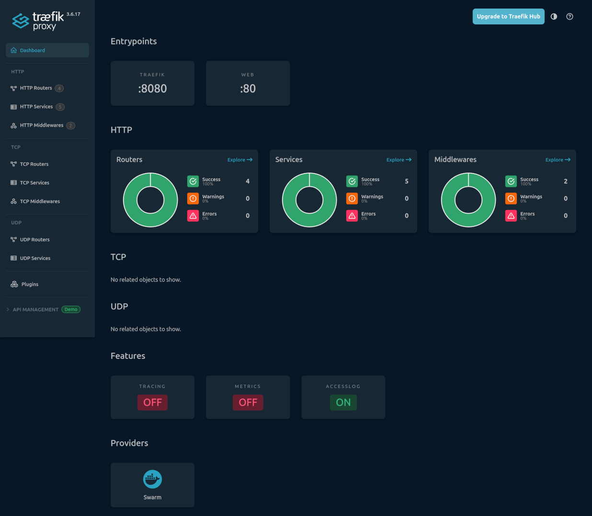
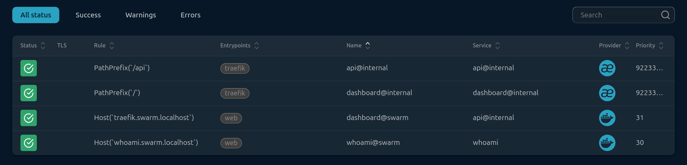
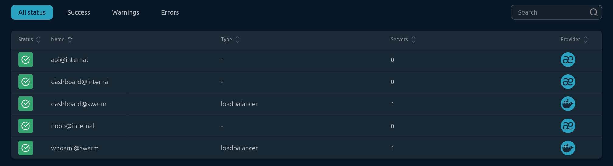
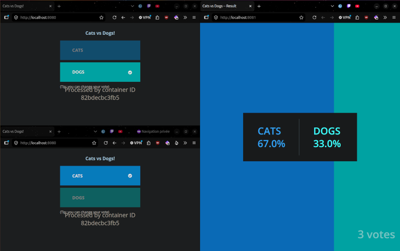
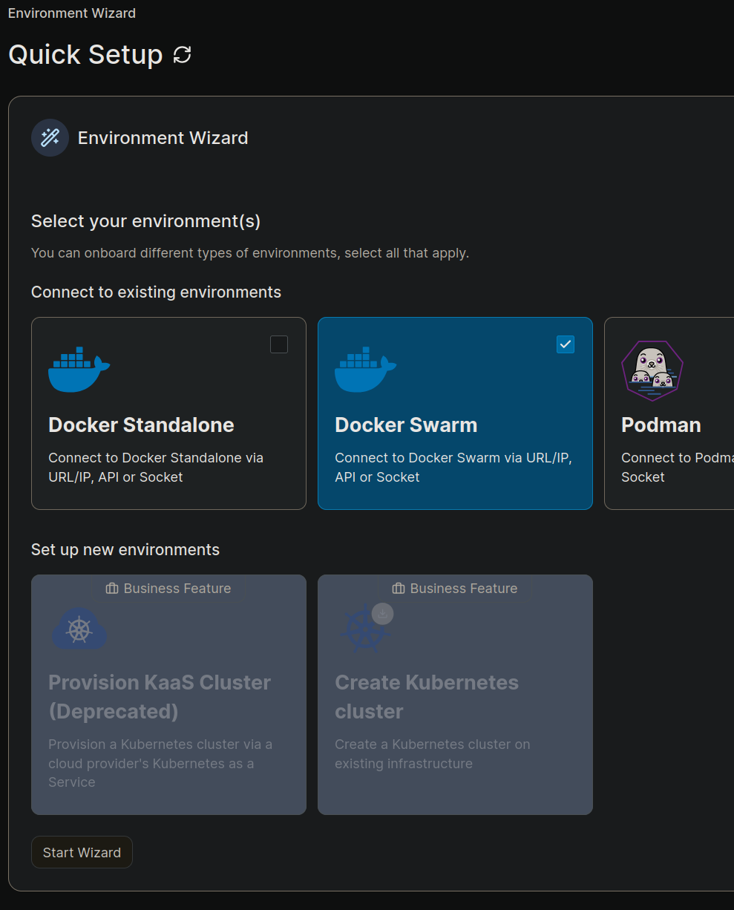
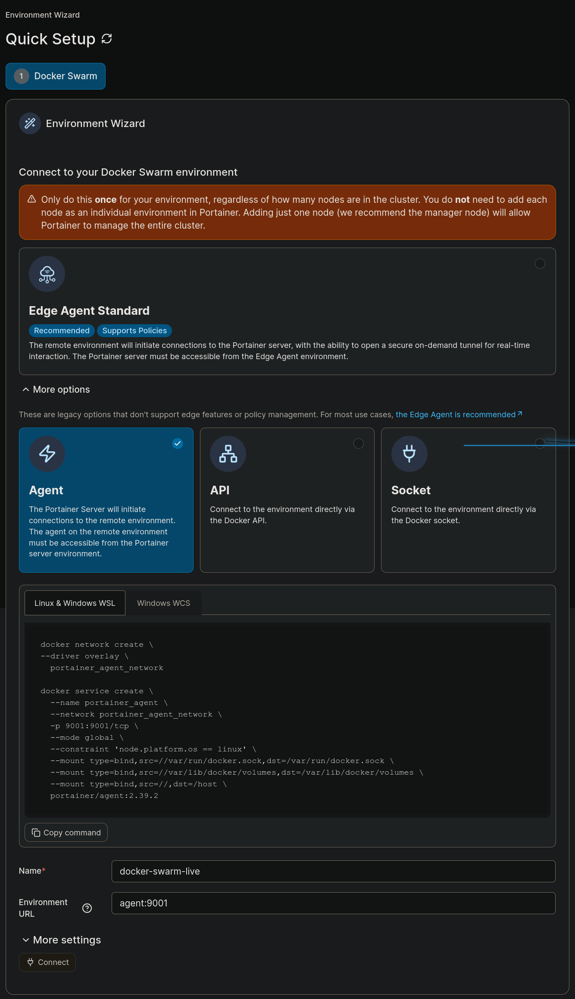
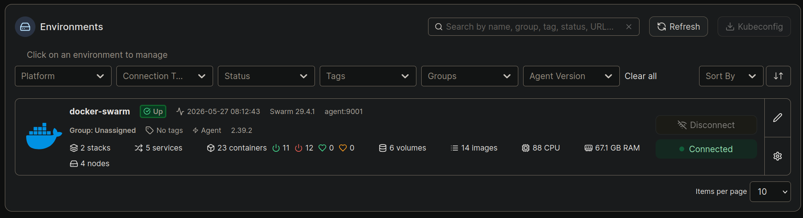
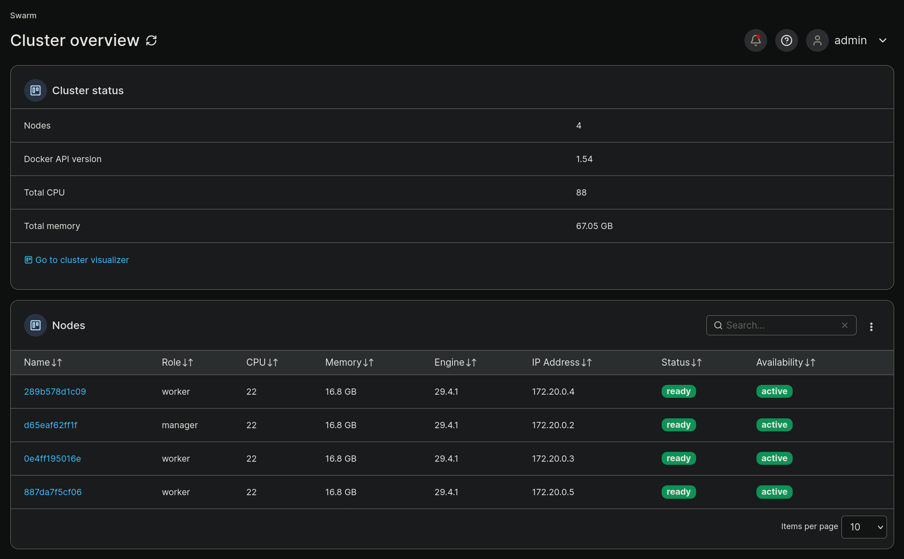
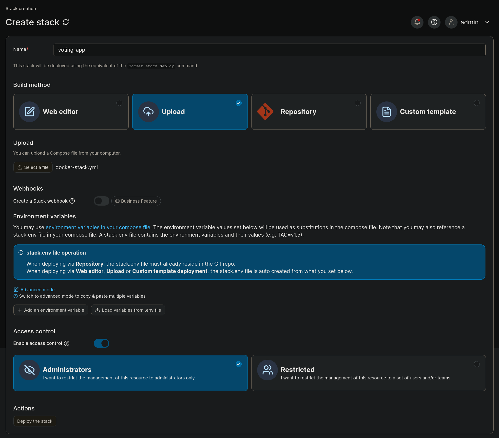
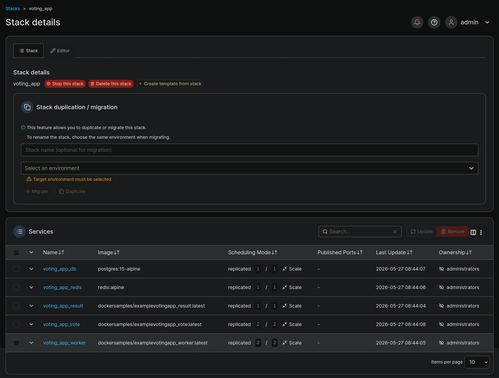

# TP Devops ESGI 2026

## Introduction

Ce projet a pour objectif de mettre en place une infrastructure DevOps pour une application web. Nous allons utiliser Docker pour containeriser notre application, Github actions pour l'intégration continue et le déploiement continu (CI/CD), et Docker swarm pour l'orchestration de nos conteneurs

## Exercices Docker Swarm

### 1.1 - Début

Docker-in-Docker (DinD) :

Sert à exécuter Docker à l'intérieur d'un conteneur Docker. Cela permet de créer des environnements de développement ou de test isolés, où les développeurs peuvent exécuter des commandes Docker sans affecter leur système hôte (Ex: images malveillantes, vulnérabilités de sécurité, etc.)
Nécessite le droit `privileged` pour fonctionner, ce qui peut poser des risques de sécurité.

Docker-out-of-Docker (DooD) :

Permet à un conteneur d'accéder au démon Docker de l'hôte. Cela signifie que les conteneurs peuvent exécuter des commandes Docker qui affectent directement l'hôte
Nécessite de monter le socket Docker de l'hôte dans le conteneur, ce qui peut exposer l'hôte à des risques de sécurité

Comment tester Docker Swarm par DinD :
1. Créer un conteneur Docker avec l'image DinD.
2. Exécuter des commandes Docker à l'intérieur du conteneur pour créer un cluster Swarm.
3. Ajouter des nœuds au cluster et vérifier leur état.

Démarrer un container :
```bash
docker run --privileged -d --name n1 docker:dind
docker exec -it n1 ash

# Dans le terminal du conteneur n1
docker ps
docker run hello-world
```

Initialiser le cluster Swarm :
```bash
docker swarm init
```
Ajouter des nœuds au cluster :
```bash
docker swarm join --token {joinToken} {managerContainer/serviceName}:2377
```

Visualiser le cluster depuis le manager:
```bash
docker node ls
```

### 1.2 - Création du cluster Docker Swarm

1) Compose qui démarre 1 manager DinD + 3 nodes DinD (privileged) : `ex2-cluster-swarm/compose.yaml`

```bash
# Lancer les containers
docker compose up -d

# Vérifier depuis l'hôte que les containers sont démarrés
docker ps

# Entrer dans un container (ex. manager) et vérifier que Docker est utilisable à l'intérieur
docker exec -it manager ash
# puis, dans le shell du container :
docker ps
```

2) Initialiser le Swarm depuis le manager

Dans le shell du container manager :
```bash
docker swarm init
```
```terminaloutput
Swarm initialized: current node (k7vprmqxoczwa8rf1m1wmy3rq) is now a manager.

To add a worker to this swarm, run the following command:

    docker swarm join --token SWMTKN-1-2061q6p8ggipieiaddzr09i9uom4lkm1tojx5z8sbvxy2572ka-58h3fyyv95nyd8cnv4f4g92g2 172.20.0.2:2377

To add a manager to this swarm, run 'docker swarm join-token manager' and follow the instructions.
```

3) Faire joindre les containers nœuds en tant que worker

Sur l'hôte, pour entrer dans un node :
```bash
docker exec -it node1 ash
```

Dans le shell du node, on exécute la commande de join fournie par le manager
```bash
docker swarm join --token {TokenWorker} manager:2377
```
```
/ # docker swarm join --token SWMTKN-1-2061q6p8ggipieiaddzr09i9uom4lkm1tojx5z8sbvxy2572ka-58h3fyyv95nyd8cnv4f4g92g2 manager:2377
This node joined a swarm as a worker.
```

4) Vérifier la liste des nœuds depuis le manager

Dans le shell du manager :
```bash
docker node ls
```
```terminaloutput
/ # docker node ls
ID                            HOSTNAME       STATUS    AVAILABILITY   MANAGER STATUS   ENGINE VERSION
oivqwn33pw9v2y4kg1ucg80kc     9a22281f9073   Ready     Active                          29.4.1
k7vprmqxoczwa8rf1m1wmy3rq *   9deb2980de4f   Ready     Active         Leader           29.4.1
7c2ftofdor3izr7riyq8s6k6d     77d8cba2fe9d   Ready     Active                          29.4.1
uzl6ohb8boemr64l3bl6gr4tt     c40af114a190   Ready     Active                          29.4.1
```

### 1.3 - Tests du cluster

1) Stack `ex3-tests/hello-world.compose.yml`

2) Copier la stack dans le manager et pérenniser les fichiers

Créer le dossier dans le manager :
```bash
docker exec -it manager ash -c 'mkdir -p /home/manager'
```
Copier depuis l'hôte vers le manager :
```bash
docker cp ex3-tests/hello-world.compose.yml manager:/home/manager/
```
```yaml
# Pour que /home/manager survivre au redémarrage du container manager :
# relancer le manager avec un volume anonyme monté sur /home/manager, dans le compose du manager
   volumes:
     - /home/manager
```

3) Déployer la stack

Depuis le manager :
```bash
docker stack deploy -c /home/manager/hello-world.compose.yml hello_stack
```
Lister les services du stack :
```bash
docker stack services hello_stack
```
Vérifier les services Swarm globalement :
```bash
docker service ls
```
```bash
# Se connecter sur chaque noeud et lister les containers
docker exec -it node1 ash 
docker ps -a

docker exec -it node2 ash
docker ps -a

docker exec -it node3 ash 
docker ps -a
```

L'image `hello-world` s'exécute et termine immédiatement. En conséquence, les tâches créées par le service seront rapidement en état "Complete/Exited" et il n'y aura pas de containers "running" persistants
Pour observer des containers en fonctionnement, utiliser une image à long running

4) Faire varier la clause `deploy`

```bash
docker stack deploy -c /home/manager/hello-world.compose.yml hello_stack

# Modifier un service en ligne :
docker service update --replicas 3 hello_stack_hello
```

Après chaque modification, réexécuter `docker stack deploy -c ...` pour appliquer le changement

### 1.4 - Premiers tests Ansible

1) Démarrer 3 containers nœuds sans modifier compose.yml

Utiliser l'option `--scale` lors du lancement :
```bash
docker compose up -d --scale node=3
```

Vérifier les 4 containers (1 manager + 3 nodes) :
```bash
docker ps
```
```terminaloutput
CONTAINER ID   IMAGE               COMMAND                  STATUS          NAMES
11789505a774   ansible-image       "docker-entrypoint..."   Up 58 seconds   ansible-manager-1
de9c5246bd4f   ansible-image       "docker-entrypoint..."   Up 58 seconds   ansible-node-1
3016b001f668   ansible-image       "docker-entrypoint..."   Up 58 seconds   ansible-node-2
ca772ae7380e   ansible-image       "docker-entrypoint..."   Up 58 seconds   ansible-node-3
```

2) Playbook Ansible `init_swarm_cluster.yml`

Le playbook automatise l'initialisation du cluster Swarm :
- Initialise Docker Swarm sur le manager (`docker swarm init`)
- Récupère le token worker
- Fait joindre les 3 workers au cluster

Modifier les variables d'inventaire pour correspondre aux noms des containers :
```ini
[managers]
# it should be the docker container name of the manager node, in our case "manager" prefixed by docker compose
ansible-manager-1

[managers:vars]
ansible_connection=community.docker.docker

[workers]
# it should be the docker container name of the worker nodes, in our case "node" prefixed by docker compose
ansible-node-1
ansible-node-2
ansible-node-3

[workers:vars]
ansible_connection=community.docker.docker
```
Modification aussi dans le `init_swarm_cluster.yml` :
```yaml
- name: Join workers to the Swarm cluster
  hosts: workers
  become: yes
  tasks:
    - name: Join swarm as worker
      command: "{{ hostvars[groups['managers'][0]]['worker_join_command'] }} {{ groups['managers'][0] }}:2377"
```

Exécuter le playbook :
```bash
./ansible.sh
```
```terminaloutput
...
PLAY RECAP **********************************************************************************************************************************************************************************************************
ansible-manager-1          : ok=5    changed=2    unreachable=0    failed=0    skipped=0    rescued=0    ignored=0   
ansible-node-1             : ok=2    changed=1    unreachable=0    failed=0    skipped=0    rescued=0    ignored=0   
ansible-node-2             : ok=2    changed=1    unreachable=0    failed=0    skipped=0    rescued=0    ignored=0   
ansible-node-3             : ok=2    changed=1    unreachable=0    failed=0    skipped=0    rescued=0    ignored=0   
```


3) Vérifier le cluster Swarm et idempotence

Vérifier que le cluster est opérationnel :
```bash
docker exec -it ansible-manager-1 ash
docker node ls
```
```terminaloutput
/ # docker node ls
ID                            HOSTNAME       STATUS    AVAILABILITY   MANAGER STATUS   ENGINE VERSION
mrgt6m0jhaue6tgzdy7weifrf     3016b001f668   Ready     Active                          29.4.1
lmn23pkc4rkfb4lh30ebx71il     11789505a774   Ready     Active                          29.4.1
o6mexwmx8pxwxcsoavbcrhgzg     ca772ae7380e   Ready     Active                          29.4.1
fwbz9ph1lrq9834o802223t5v *   de9c5246bd4f   Ready     Active         Leader           29.4.1
```

Relancer le même playbook :
```bash
bash ansible.sh
```

Remarque : le playbook est idempotent. À la deuxième exécution, il ne refait pas `docker swarm init` (car le nœud est déjà manager) et détecte que les workers sont déjà dans le cluster

### 1.5 - Comprendre Ansible

1) Ajouter un nœud supplémentaire au cluster

Démarrer un nœud supplémentaire :
```bash
docker compose up -d --scale node=4
```

Adapter l'inventaire `ansible/inventory.ini` :
```ini
[managers]
ansible-manager-1

[managers:vars]
ansible_connection=community.docker.docker

[workers]
ansible-node-1
ansible-node-2
ansible-node-3
ansible-node-4

[workers:vars]
ansible_connection=community.docker.docker
```

Réexécuter le playbook :
```bash
./ansible.sh
```
```terminaloutput
✅ Running Ansible Playbooks...

PLAY [Initialize Docker Swarm] **************************************************************************************************************************************************************************************

TASK [Gathering Facts] **********************************************************************************************************************************************************************************************
[WARNING]: Host 'ansible-manager-1' is using the discovered Python interpreter at '/usr/bin/python3.12', but future installation of another Python interpreter could cause a different interpreter to be discovered. See https://docs.ansible.com/ansible-core/2.19/reference_appendices/interpreter_discovery.html for more information.                                                                                                 
ok: [ansible-manager-1]

TASK [Initialize swarm on first manager] ****************************************************************************************************************************************************************************
[ERROR]: non-zero return code
changed: [ansible-manager-1]

TASK [Retrieve worker join token] ***********************************************************************************************************************************************************************************
changed: [ansible-manager-1]

TASK [Set worker join token as a fact] ******************************************************************************************************************************************************************************
ok: [ansible-manager-1]

TASK [Check join command (for workers)] *****************************************************************************************************************************************************************************
ok: [ansible-manager-1] => {
    "worker_join_command": "docker swarm join --token SWMTKN-1-2bbeagq4grg8yvk990dj7t3kjtg9z18rg4k8yemt5filafde0v-2pia8o7sxcaq7vtfwlt2vkdyh"
}

PLAY [Join workers to the Swarm cluster] ****************************************************************************************************************************************************************************

TASK [Gathering Facts] **********************************************************************************************************************************************************************************************
[WARNING]: Host 'ansible-node-1' is using the discovered Python interpreter at '/usr/bin/python3.12', but future installation of another Python interpreter could cause a different interpreter to be discovered. See https://docs.ansible.com/ansible-core/2.19/reference_appendices/interpreter_discovery.html for more information.                                                                                                    
ok: [ansible-node-1]
[WARNING]: Host 'ansible-node-3' is using the discovered Python interpreter at '/usr/bin/python3.12', but future installation of another Python interpreter could cause a different interpreter to be discovered. See https://docs.ansible.com/ansible-core/2.19/reference_appendices/interpreter_discovery.html for more information.                                                                                                    
ok: [ansible-node-3]
[WARNING]: Host 'ansible-node-4' is using the discovered Python interpreter at '/usr/bin/python3.12', but future installation of another Python interpreter could cause a different interpreter to be discovered. See https://docs.ansible.com/ansible-core/2.19/reference_appendices/interpreter_discovery.html for more information.                                                                                                    
ok: [ansible-node-4]
[WARNING]: Host 'ansible-node-2' is using the discovered Python interpreter at '/usr/bin/python3.12', but future installation of another Python interpreter could cause a different interpreter to be discovered. See https://docs.ansible.com/ansible-core/2.19/reference_appendices/interpreter_discovery.html for more information.                                                                                                    
ok: [ansible-node-2]

TASK [Join swarm as worker] *****************************************************************************************************************************************************************************************
changed: [ansible-node-1]
changed: [ansible-node-3]
changed: [ansible-node-2]
changed: [ansible-node-4]

PLAY RECAP **********************************************************************************************************************************************************************************************************
ansible-manager-1          : ok=5    changed=2    unreachable=0    failed=0    skipped=0    rescued=0    ignored=0   
ansible-node-1             : ok=2    changed=1    unreachable=0    failed=0    skipped=0    rescued=0    ignored=0   
ansible-node-2             : ok=2    changed=1    unreachable=0    failed=0    skipped=0    rescued=0    ignored=0   
ansible-node-3             : ok=2    changed=1    unreachable=0    failed=0    skipped=0    rescued=0    ignored=0   
ansible-node-4             : ok=2    changed=1    unreachable=0    failed=0    skipped=0    rescued=0    ignored=0  
```
Vérifier que le nouveau nœud fait partie du cluster :
```bash
docker exec -it ansible-manager-1 ash
docker node ls
```
```terminaloutput
/ # docker node ls
ID                            HOSTNAME       STATUS    AVAILABILITY   MANAGER STATUS   ENGINE VERSION
sjjwh7zvp79ul59i9v1g3ec5s     74f9f867ef54   Ready     Active                          29.4.1
mrgt6m0jhaue6tgzdy7weifrf     3016b001f668   Ready     Active                          29.4.1
lmn23pkc4rkfb4lh30ebx71il     11789505a774   Ready     Active                          29.4.1
o6mexwmx8pxwxcsoavbcrhgzg     ca772ae7380e   Ready     Active                          29.4.1
fwbz9ph1lrq9834o802223t5v *   de9c5246bd4f   Ready     Active         Leader           29.4.1
```
Le playbook est toujours idempotent : le nouveau nœud rejoint le cluster, les anciens restent inchangés.

2) Utilisation d'Ansible sur des VMs/VPS Linux classiques par ssh

Changements dans l'inventaire :
```ini
[managers]
user@ip_manager_vm  ansible_port=22  ansible_user=ubuntu

[managers:vars]
ansible_connection=ssh
ansible_private_key_file=~/.ssh/id_rsa

[workers]
user@ip_worker1_vm  ansible_port=22  ansible_user=ubuntu
user@ip_worker2_vm  ansible_port=22  ansible_user=ubuntu
user@ip_worker3_vm  ansible_port=22  ansible_user=ubuntu

[workers:vars]
ansible_connection=ssh
ansible_private_key_file=~/.ssh/id_rsa
```

Changements dans le playbook :
- Supprimer `become: yes` selon les droits sudo disponibles
- Remplacer `ansible_connection=community.docker.docker` par `ansible_connection=ssh`
- Assurer que Docker est installé et que l'utilisateur a les droits appropriés

Via Docker Compose, on utilise le plugin `community.docker.docker`, en ssh, on utilise simplement `ssh`

3) Incorporer Ansible dans le dossier de travail

Structure :
```
ansible/
  ├── compose.yml                    # Compose pour tests locaux (DinD)
  ├── ansible.sh                     # Script de lancement
  └── ansible/
      ├── inventory.ini              # Inventaire
      ├── init_swarm_cluster.yml     # Playbook principal
      └── README.md                  # Documentation spécifique Ansible (détails ajouté par IA)
```

Installation locale :
```bash
cd ansible
./ansible.sh
```

**Documentation dans `ansible/README.md`** :
```markdown
# Ansible - Configuration du Cluster Docker Swarm

## Utilisation locale (Docker)
docker compose up -d --scale node=3
./ansible.sh

## Utilisation sur VMs SSH
Modifier inventory.ini avec les adresses IP et clés SSH
./ansible.sh

## Vérification
docker exec -it ansible-manager-1 ash
docker node ls
```

4) Terraform et son utilisation avec Ansible

Terraform est un outil d'Infrastructure-as-Code (IaC) pour provisionner et gérer l'infrastructure cloud/virtualisée. 
Il automatise la création de ressources (VMs, réseaux, bases de données).

Différence avec Ansible :
- Terraform : provisioning (création/suppression de ressources), déclaratif (`what`)
- Ansible : configuration management (installation de logiciels, configuration), impératif (`how`)

Utilisation ensemble : Terraform crée les VMs, Ansible configure les VMs

Terraform génère l'inventaire Ansible automatiquement, puis Ansible configure chaque nœud.

# Traefik & Portainer

## Exercice 1 - Déployer Traefik

### 1.2 - Déployer Traefik sur le cluster Swarm

**Prérequis** : cluster Swarm opérationnel avec 1 manager + 3 nodes (voir section 1.4)

Redémarrer le compose avec l'exposition des ports :
```bash
cd ansible
docker compose up -d --scale node=3
```

Créer le réseau overlay `web` (depuis le manager) :
```bash
docker exec -it ansible-manager-1 ash
docker network create -d overlay web
dockr mkdir home/manager
exit
```

Déployer la stack Traefik depuis le manager :
```bash
docker cp traefik.yml ansible-manager-1:/home/manager/
docker exec -it ansible-manager-1 ash
docker stack deploy -c /home/manager/traefik.yml traefik_stack
exit
```

Ou directement depuis l'hôte, en copiant le fichier :
```bash
docker cp ansible/traefik.yml ansible-manager-1:/home/manager/
docker exec -it ansible-manager-1 docker stack deploy -c /home/manager/traefik.yml traefik_stack
```

Vérifier la stack :
```bash
docker exec -it ansible-manager-1 ash
docker stack services traefik_stack
docker service ls
exit
```
```terminaloutput
/ # docker stack services traefik_stack
ID             NAME                    MODE         REPLICAS   IMAGE                   PORTS
wbb0lgmbfrre   traefik_stack_traefik   replicated   1/1        traefik:v3.6            *:80->80/tcp
rhz2rucal20d   traefik_stack_whoami    replicated   1/1        traefik/whoami:latest   
```

### 1.3 - Tester Traefik localement

Accéder au tableau de bord Traefik :
```
http://traefik.swarm.localhost
```

Accéder à l'application Whoami (test) :
```
http://whoami.swarm.localhost
```

Bien vérifier que :
- Port 80:80 est exposé sur le manager (visible dans `docker ps`)
- Réseau overlay `web` est créé et utilisé par les services
- Services Traefik et Whoami sont en mode `replicated` et `Running`
- Les DNS locaux ont été configurés dans `/etc/hosts` :
```
127.0.0.1 traefik.swarm.localhost 
127.0.0.1 whoami.swarm.localhost
```







Résultat whoami :
```html
Hostname: a4f2f9b7b0cd
IP: 127.0.0.1
IP: ::1
IP: 10.0.1.3
IP: 172.18.0.3
RemoteAddr: 10.0.1.6:51202
GET / HTTP/1.1
Host: whoami.swarm.localhost
User-Agent: Mozilla/5.0 (X11; Ubuntu; Linux x86_64; rv:151.0) Gecko/20100101 Firefox/151.0
Accept: text/html,application/xhtml+xml,application/xml;q=0.9,*/*;q=0.8
Accept-Encoding: gzip, deflate, br, zstd
Accept-Language: fr-FR,en-US;q=0.9,en;q=0.8
Priority: u=0, i
Sec-Fetch-Dest: document
Sec-Fetch-Mode: navigate
Sec-Fetch-Site: none
Sec-Fetch-User: ?1
Upgrade-Insecure-Requests: 1
X-Forwarded-For: 10.0.0.2
X-Forwarded-Host: whoami.swarm.localhost
X-Forwarded-Port: 80
X-Forwarded-Proto: http
X-Forwarded-Server: 17c5438329b2
X-Real-Ip: 10.0.0.2
```

## Exercice 2 - Déployer une autre application

### 2.1 - Comprendre example-voting-app

Application de vote distribuée composée de :

- vote (Python Flask) : interface de vote (frontend)
- redis : cache des votes en cours
- worker (C#) : traite les votes de redis vers la base de données
- result (Node.js) : affiche les résultats (frontend)
- db (PostgreSQL) : base de données des votes

Architecture :
```
Utilisateur → [vote] → (réseau frontend + redis) → [worker] → (réseau backend + db) → [result] → Utilisateur
```

Tester localement (pour comprendre le fonctionnement) :
```bash
git clone https://github.com/dockersamples/example-voting-app.git
cd example-voting-app
docker compose up -d
```



### 2.2 - Déployer la stack sur Docker Swarm

Depuis le dossier `example-voting-app`, copier la stack dans le manager :
```bash
docker cp docker-stack.yml ansible-manager-1:/home/manager/voting_stack.yml
```

Déployer sur le cluster Swarm :
```bash
docker exec -it ansible-manager-1 ash
docker stack deploy -c /home/manager/voting_stack.yml voting_app
```

Vérifier le déploiement :
```bash
docker stack services voting_app
```
```terminaloutput
/ # docker stack services voting_app
ID             NAME                MODE         REPLICAS   IMAGE                                          PORTS
wibbpc0arehu   voting_app_db       replicated   1/1        postgres:15-alpine                             
yp0qv1wgbwbo   voting_app_redis    replicated   1/1        redis:alpine                                   
hp805vqmri8d   voting_app_result   replicated   1/1        dockersamples/examplevotingapp_result:latest   
3t8c32ybljfi   voting_app_vote     replicated   2/2        dockersamples/examplevotingapp_vote:latest     
tecwc8jmtkxl   voting_app_worker   replicated   2/2        dockersamples/examplevotingapp_worker:latest   
```

### 2.3 - Router les services avec Traefik

Modification du docker-stack.yml pour ajouter Traefik labels et connecter les services au réseau overlay `web` :

```yaml
  vote:
    image: dockersamples/examplevotingapp_vote
    networks:
      - frontend
      - web
    deploy:
      replicas: 2
      labels:
        - "traefik.enable=true"
        - "traefik.http.routers.vote.rule=Host(`vote.swarm.localhost`)"
        - "traefik.http.routers.vote.entrypoints=web"
        - "traefik.http.services.vote.loadbalancer.server.port=80"

  result:
    image: dockersamples/examplevotingapp_result
    networks:
      - backend
      - web
    deploy:
      labels:
        - "traefik.enable=true"
        - "traefik.http.routers.result.rule=Host(`result.swarm.localhost`)"
        - "traefik.http.routers.result.entrypoints=web"
        - "traefik.http.services.result.loadbalancer.server.port=80"

networks:
  web:
    external: true
```

Le fichier a été modifié pour inclure :
- Labels Traefik sur les services `vote` et `result`
- Connexion des services au réseau `web`
- Suppression des ports `8080` et `8081`

Mettre à jour `/etc/hosts` pour ajouter les nouvelles URLs :
```bash
sudo nano /etc/hosts
# Ajouter ou modifier les lignes :
127.0.0.1 vote.swarm.localhost 
127.0.0.1 result.swarm.localhost
```

Redéployer la stack avec la configuration mise à jour :
```bash
docker cp example-voting-app/docker-stack.yml ansible-manager-1:/home/manager/voting_stack.yml
docker exec -it ansible-manager-1 ash
docker stack deploy -c /home/manager/voting_stack.yml voting_app
```

Accéder aux applications :
- Vote : http://vote.swarm.localhost
- Résultats : http://result.swarm.localhost
- Dashboard Traefik : http://traefik.swarm.localhost

## Exercice 3 - Déployer Portainer

### 3.1 - Déployer Portainer sur Docker Swarm

Portainer est une interface web pour gérer Docker Swarm. Il permet de visualiser les nœuds, services, stacks et volumes.

Copier la stack Portainer dans le manager :
```bash
docker cp ansible/portainer.yml ansible-manager-1:/home/manager/
```

Déployer Portainer sur le cluster Swarm :
```bash
docker exec -it ansible-manager-1 ash
docker stack deploy -c /home/manager/portainer.yml portainer_stack
```

Vérifier le déploiement :
```bash
docker stack services portainer_stack
```
```terminaloutput
/ # docker stack services portainer_stack
ID             NAME                        MODE         REPLICAS   IMAGE                        PORTS
zb6jq2e7c02h   portainer_stack_agent       global       0/4        portainer/agent:lts          
1hjqu1t1m6s3   portainer_stack_portainer   replicated   0/1        portainer/portainer-ce:lts   
```

Architecture déployée :
- Agent (mode `global`) : s'exécute sur tous les nœuds, collecte les infos Docker
- Portainer (manager) : interface web pour gérer le Swarm via les agents

### 3.2 - Ajouter les labels Traefik pour publier Portainer

Le fichier `ansible/portainer.yml` a été modifié pour :
- Ajouter les labels Traefik au service `portainer`
- Connecter le service au réseau overlay `web`
- Supprimer les ports `9000`, `9443`, `8000` (gérés par Traefik)

Configuration ajoutée :
```yaml
  portainer:
    # ...existing config...
    networks:
      - agent_network
      - web
    deploy:
      labels:
        - "traefik.enable=true"
        - "traefik.http.routers.portainer.rule=Host(`portainer.swarm.localhost`)"
        - "traefik.http.routers.portainer.entrypoints=web"
        - "traefik.http.services.portainer.loadbalancer.server.port=9000"

networks:
    web:
      external: true
```

Redéployer avec la configuration mise à jour :
```bash
docker cp ansible/portainer.yml ansible-manager-1:/home/manager/
docker exec -it ansible-manager-1 ash
docker stack deploy -c /home/manager/portainer.yml portainer_stack
```

### 3.3 - Accéder à Portainer via Traefik

Mettre à jour `/etc/hosts` pour ajouter `portainer.swarm.localhost` :
```bash
sudo nano /etc/hosts
# Ajouter ou modifier la ligne existante :
127.0.0.1 portainer.swarm.localhost
```

Setup Portainer :
1. Accéder à http://portainer.swarm.localhost
2. Créer un compte admin
3. Choisir "Docker Swarm" comme environnement
4. Sélectionner "Agent"
5. Nommer et connecter à l'agent `agent:9001`
6. Valider et accéder au dashboard









## Exercice 4 - Re-déployer l'app de votes

### 4.1 - Supprimer la stack de vote depuis le CLI

Lister les stacks actuelles :
```bash
docker exec -it ansible-manager-1 ash 
docker stack ls
```
```terminaloutput
NAME              SERVICES
portainer_stack   2       
traefik_stack     2       
voting_app        5       
```

Supprimer la stack `voting_app` :
```bash
docker stack rm voting_app
```
```terminaloutput
Removing service voting_app_db
Removing service voting_app_redis
Removing service voting_app_result
Removing service voting_app_vote
Removing service voting_app_worker
Removing network voting_app_frontend
Removing network voting_app_backend
```

### 4.2 - Redéployer la stack depuis Portainer

Se connecter à Portainer :
```
http://portainer.swarm.localhost
```

Étapes dans Portainer :

1. Accéder au menu Stacks (dans la navigation de gauche ou via le dashboard)

2. Cliquer sur le bouton "Add stack"

3. Sélectionner Docker Swarm (si ce n'est pas déjà fait)

4. Upload file** → sélectionner `example-voting-app/docker-stack.yml`

5. Donner un nom à la stack : `voting_app`

6. Cliquer sur Deploy the stack





Vérification :

```bash
docker exec -it ansible-manager-1 docker stack ls
```
```terminaloutput
NAME              SERVICES 
portainer_stack   2
traefik_stack     2
voting_app        5
```

Voir les services en cours de déploiement :
```bash
docker exec -it ansible-manager-1 docker stack services voting_app
```
```terminaloutput
ID             NAME                MODE         REPLICAS   IMAGE                                          
wibbpc0arehu   voting_app_db       replicated   1/1        postgres:15-alpine                             
yp0qv1wgbwbo   voting_app_redis    replicated   1/1        redis:alpine                                   
hp805vqmri8d   voting_app_result   replicated   1/1        dockersamples/examplevotingapp_result:latest   
3t8c32ybljfi   voting_app_vote     replicated   2/2        dockersamples/examplevotingapp_vote:latest     
tecwc8jmtkxl   voting_app_worker   replicated   2/2        dockersamples/examplevotingapp_worker:latest   
```


